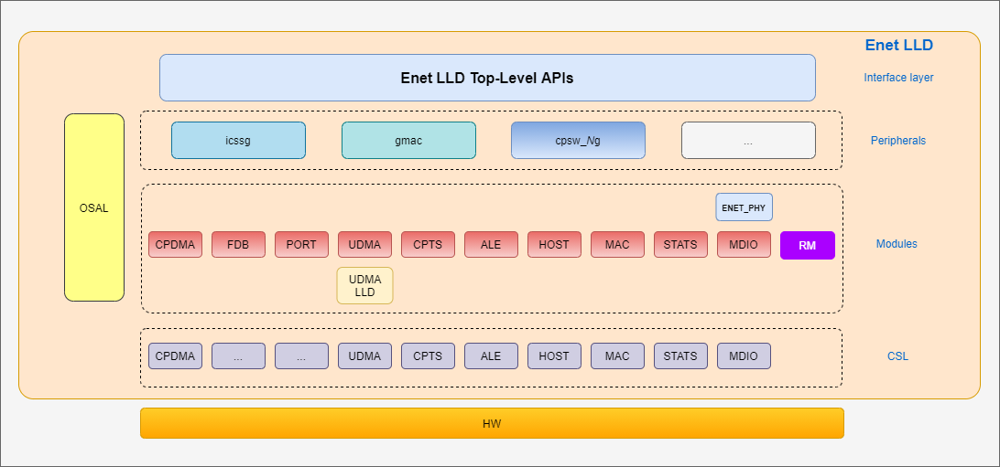

# Ethernet Low Level Drivers

## Introduction

The Unified Ethernet Low-Level Driver (Enet LLD) is a driver that aims at providing an unified interface for the different Ethernet peripherals found in Sitara MCU+ class of devices from Texas Instruments. These devices currently include:
- [AM2431](https://www.ti.com/product/AM2431), [AM2432](https://www.ti.com/product/AM2432), [AM2434](https://www.ti.com/product/AM2434)
- [AM2634](https://www.ti.com/product/AM2634), [AM2634-Q1](https://www.ti.com/product/AM2634-Q1)
- [AM2732](https://www.ti.com/product/AM2732)
- [AM6411](https://www.ti.com/product/AM6411), [AM6412](https://www.ti.com/product/AM6412), [AM6421](https://www.ti.com/product/AM6421), [AM6422](https://www.ti.com/product/AM6422), [AM6441](https://www.ti.com/product/AM6441), [AM6442](https://www.ti.com/product/AM6442) 

## Features

- Supports both CPSW and ICSSG peripherals.
- Provided with pre-built ICSS firmware binary for ICSS PRU.
- Provides control and datapath (DMA) programming Interfaces for application.
- Integrated with LwIP adaptation layer to interface with LwIP networking stack.
- Operating syhstem agnostic. Currently Supports FreeRTOS and bare metal (NoRTOS) applications.
- Includes drivers to support the below Ethernet PHY transceiver along with any other generic Ethernet PHY transceivers that can be modified to support various other Ethernet PHY transceivers.
    - [DP83822](https://www.ti.com/product/DP83822I)
    - [DP83867](https://www.ti.com/product/DP83867)
    - [DP83869](https://www.ti.com/product/DP83869)
    - [VSC8514](https://www.microchip.com/en-us/product/VSC8514)
- Currently, supports below distinguished features apart from basic Ethernet features.
    - AM243x: MAC Mode, Switch Mode, Timestamping, multi-channel, DSCP, Policer and Rate Limiters, TCP/IP checksum offload.
    - AM263x: MAC Mode, Switch Mode, Timestamping, multi-channel, DSCP, TSN-EST, Policer and Rate Limiters, Interrupt Pacing, Tx Scatter-Gather, TCP/IP checksum offload.
    - AM273x: Timestamping, multi-channel, DSCP, TSN-EST, Policer and Rate Limiters, Interrupt Pacing, Tx Scatter-Gather, TCP/IP checksum offload.
    - AM64x: MAC Mode, Switch Mode, Timestamping, multi-channel, DSCP, Policer and Rate Limiters, TCP/IP checksum offload.

## Overview

The Enet LLD is composed of the following layers: top-layer APIs, peripheral layer, module layer and CSL. CSL layer has SOC specific hardware register defination and it is part of MCU_PLUS_SDK repository

---

---

## Usage

Enen though enetLLD is a seperate repository, it is not independent. It has dependencies to other repositories such as MCU_PLUS_SDK, FreeRTOS and LwIP. It uses the build system from MCU_PLUS_SDK and hence please refer to MCU_PLUS_SDK for instructions about compilation, documentation generation and usage.

## Contributing to the project
Currently, this project does not accept contributions.
